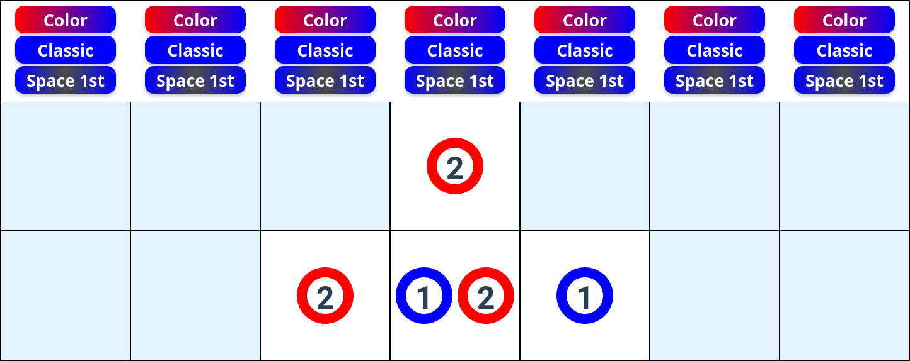
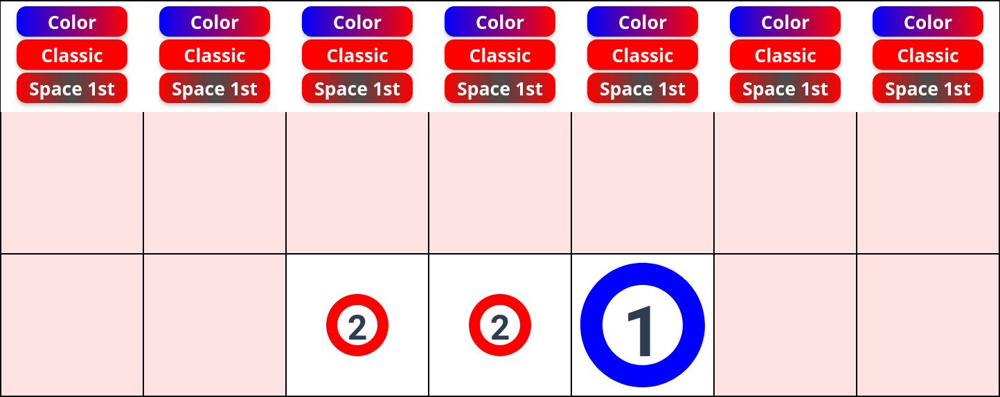
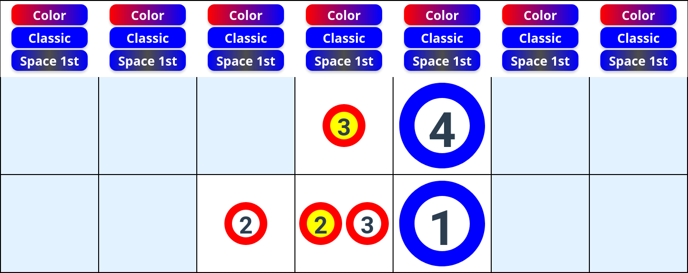

# q4 - A Quantum(-inspired) Connect Four Game

## Concepts

Q4 offers:

* Superposition in
  * space (location of pieces)
  * color (the player to which a piece belongs)
* Classical pieces

  

While you can insert **quantum** pieces, you need to collapse them into four **classical** pieces in order to win.

## Example

First, its Blue's turn: Blue inserts the "1" piece at a superposition of two columns.
Then, Red also inserts a space-superpositioned piece in the middle column and the leftmost nonempty column.
Both pieces are now entangled: if the "1" piece is in the middle, the "2" must be either on top or in the column to the left.

**As in classical Connect Four, only a single classical piece can occupy a cell.**

In order to collapse a quantum piece to a classical one, you can click on it.
The yellow effect on mouse-over highlights the pieces unaffected by a collapsing the hovered piece:

As it's Blue's turn again, Blue can decide to do exactly this in order to decide where the "1" piece is finally placed:

Depending on the selected game mode, this is may complete the move of player Blue.

Now, suppose that it's Red's turn. 
Red inserts a color-superpositioned piece in the middle column.
Since the location of the "2" piece is still undecided, this color piece may end up at different positions.
Again, this is indicated in the GUI by the small "3" pieces in the middle column.

The big "3" piece in the column to the right is placed by the blue player.
The location of this piece is well-known and constant, just its color is still uncertain.

Since its Red's turn again, Red decides to collapse the color-superpositioned piece by clicking on one of the "3" pieces in the middle column.
This turns them both red (but doesn't affect their superposition in space).
The other part of the "3" piece on the right becomes a blue "4" piece:

